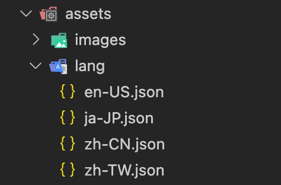

# Flutter Independent Localization

> Easily Localize without BuildContext

## Setup

1. Create a folder in `assets/` with name `Lang`.
2. Create json files to define translation in that folder with this format `{langCode}-{countryCode}.json`.
   <br>For example:


<br><br>

3. In these json files, format should be like this:

```
{
    "example key" : "Example",
    "other key" : "Others"
}
```
4. Assign these assets in `pubspec.yaml`.
```yaml
flutter:
  # The following line ensures that the Material Icons font is
  # included with your application, so that you can use the icons in
  # the material Icons class.
  uses-material-design: true

  # To add assets to your application, aPdd an assets section, like this:
  assets:
    - assets/lang/ # <---- add this
```

5. In main() method, initialize `IndependentLocalization` like this:

```dart
    WidgetsFlutterBinding.ensureInitialized();
    await IndependentLocalization(
            fallbackLocale: LocalizationManager.defaultLocale,
            localesJson: await LocalizationManager.localeJson)
        .initialize();
```

5. `localesJson` must be loaded with `rootBundle` from `assets`.

```dart
  static Future<Map<Locale, String>> get localeJson async => {
        LOCALE_JP: await rootBundle.loadString('assets/lang/ja-JP.json'),
        LOCALE_EN: await rootBundle.loadString('assets/lang/en-US.json'),
        LOCALE_CH_CN: await rootBundle.loadString('assets/lang/zh-CN.json'),
        LOCALE_CH_TW: await rootBundle.loadString('assets/lang/zh-TW.json'),
      };
```

Done!. You are ready to run it.

---
Usage: `"sometext".tr` or `tr("sometext")`<br>

|Method|Description|
|---|---|
|Get singleton instance| `IndependentLocalization.instance`|
|Get current language | `IndependentLocalization.instance!.currentLocale` |
|Change current language | `IndependentLocalization.instance!.changeLocale(locale)`